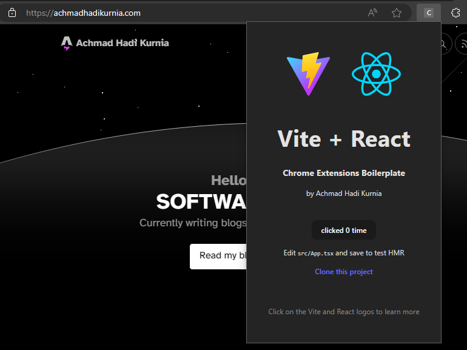

# Chrome Extensions Boilerplate
Using Vite, TypeScript, and React to create your own Chrome extensions

## Support us

Want to provide tangible support? Use the following platform to contribute to open-source software developers. Every contribution you make is a significant boost to continue building and enhancing technology that benefits everyone.

- Buy Me a Coffee https://s.id/hadibmac
- Patreon https://s.id/hadipatreon
- Saweria https://s.id/hadisaweria

We highly appreciate you sending us a few cups of coffee to accompany us while writing code. Super thanks.

## Installation
Clone my project

To clone:

```bash
clone https://github.com/achmadhadikurnia/chrome-extensions-boilerplate
```

Alternatively, you can first fork the project and then clone it:

```bash
clone https://github.com/<username>/chrome-extensions-boilerplate
```

Then navigate to your project directory:

```bash
bash chrome-extensions-boilerplate
```

## Write your code
Start writing code for your project using React and Vite.

Don't forget to customize your Chrome Extension's manifest file in `./public/manifest.json`.

```json
{
    "manifest_version": 3,
    "name": "Chrome Extensions Boilerplate",
    "version": "1.0",
    "description": "Using Vite, TypeScript, and React to create a Chrome extensions",
    "author": "Achmad Hadi Kurnia",
    "action": {
        "default_popup": "index.html"
    },
    "permissions": [
        "scripting",
        "tabs",
        "activeTab"
    ],
    "host_permissions": [
        "https://*/*",
        "http://*/*"
    ]
}
```

## Build
Run the following command to build the project:

```bash
npm run build
```

## Install to Chrome/Edge
Now open `chrome://extensions`, and enable Developer Mode if it's not already enabled. Click on "Load Unpacked" and select the `dist` folder from your local file system.

Voila! Your Chrome Extension is ready to use.


